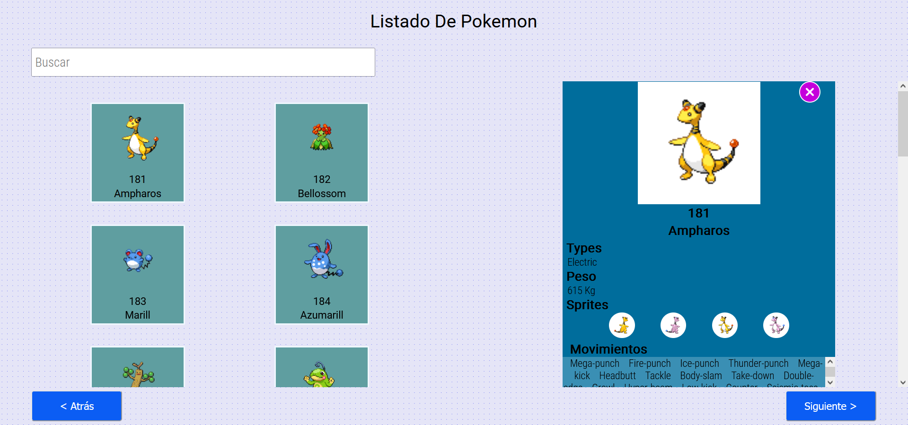
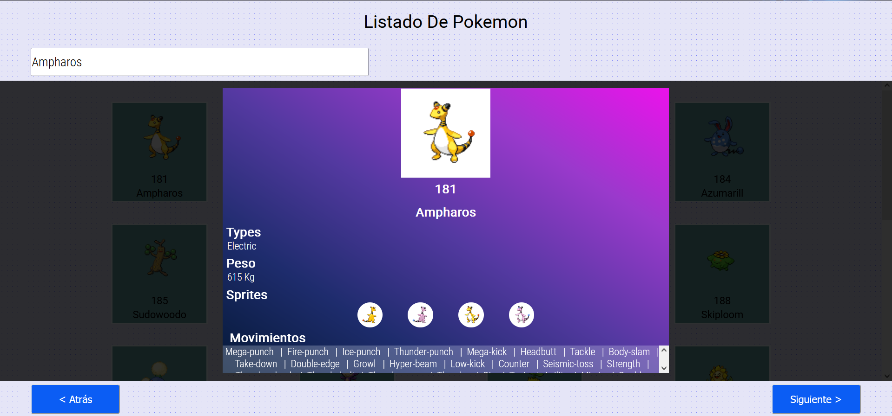

# POKEMON APP

This project is based on React.js, and implements an public API of Pokemon anime. Allows users to view the list of pokemon, display their information and search for them by name.    

## API

The API website url is:
```markdown 
    https://pokeapi.co/ 
```

The url API query is:  
```markdown 
    https://pokeapi.co/api/v2/pokemon/ 
```
Followed by the pokemon name or you will get a nested 20 items list followed by a next and previous link.

The response is given in JSON format. 

### `Development`
The language used is Javascript with the framework Reactjs. The currrently gui is been shown in the above picture.



To use the search functionality the user has to enter the pokemon name in the input label and inmediately the app ask for the API info.
To undo the results the user has to enter o delete the name, at the same happends when the name is not found.



### `Implementation`
To do the implementation, the frontend includes testing based on components. So, it is used the next libraries:
```markdown
    "@testing-library/jest-dom": "^5.16.5",
    "@testing-library/react": "^13.4.0",
    "@testing-library/user-event": "^13.5.0",
```

### `Run APP`
To run in a local server, you need  NPM and Node, download this repository and wun the command:
```markdown
    npm install
    npm start
```

### `Next steps`
To improve the APP, the nest development is about:
- Improve the gui design, to be more friendly
- Implement a deeper API response testing
- Improve the mobile design 